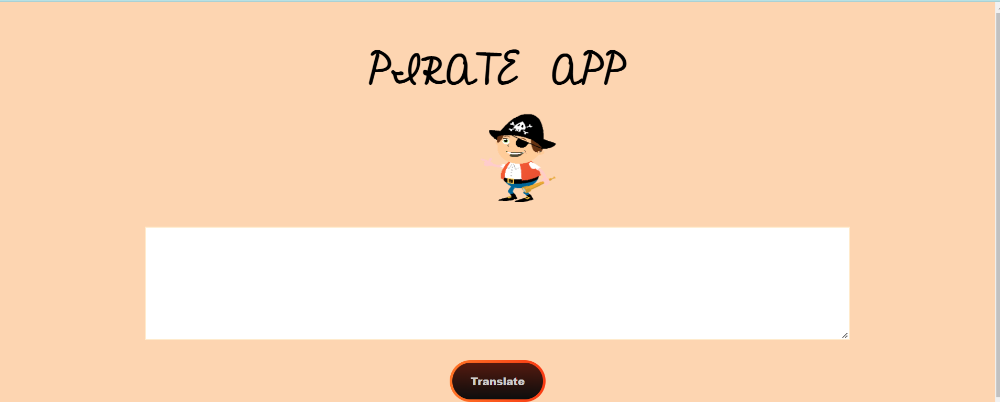

# pirate-app

Pirate app made using vanilla javascript. I have used api [Pirate Api](https://funtranslations.com/pirate) and fetch data through fetch and learn lots of DOM methods like addlistener, click function and how to show data in proper way. 

Here is [Demo](https://pirate-js.netlify.app/) of the app.

# Technologies Used:
1) Html
2) CSS
3) JavaScript

# Here is Layout of app.

